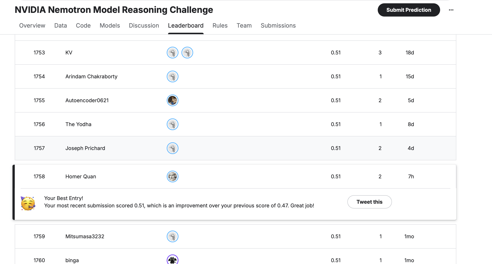

# Nemotron-3 Reasoning Improvement Pipeline (PRM + GRPO)

This project contains the complete pipeline for fine-tuning the **Nemotron-3-Nano** model to enhance its mathematical reasoning capabilities. The repository implements a two-stage reasoning reinforcement learning pipeline based on a Process Reward Model (PRM) and Group Relative Policy Optimization (GRPO).



## Architecture Overview

1. **Supervised Fine-Tuning (SFT)**: Baselines the model to adopt a Chain-of-Thought (CoT) format ending with `\boxed{}`.
2. **Process Reward Model (PRM)**: Trains a generative LoRA adapter to score individual reasoning steps (predicting if a candidate mathematical step is logically correct or flawed).
3. **Reinforcement Learning (GRPO)**: Uses the PRM to provide step-by-step intermediate rewards during rollouts to correct hallucinations early and reinforce successful logic branches using TRL's `GRPOTrainer`.

## Datasets
The reasoning reinforcement pipeline uses high-quality datasets containing detailed Chain-of-Thought (CoT) reasoning steps for mathematical problems.

### Core Training Subsets
- **SFT Baseline Data (`reasoning_dataset`, ~40MB)**: A consolidated instruction dataset containing a total of **19,500** reasoning examples. 
  - **9,500** exact-match cryptographic mappings and cipher logic paths derived from the local `train.csv`.
  - **10,000** arithmetic logic traces pulled directly from [meta-math/MetaMathQA](https://huggingface.co/datasets/meta-math/MetaMathQA). 
  - All text sequences are parsed to enforce the rigorous `\boxed{}` final answer structural constraint.
- **PRM Training Data (`generative_prm_dataset`, ~81MB)**: Synthesized from **5,000** MetaMathQA problems. For each step in the CoT trajectory, two examples are generated: 
  - A positive example (`label=1`) representing the true logic.
  - A negative/corrupted example (`label=0`) where numbers, operators (`+`, `-`, `*`), or logic have been programmatically mutated to teach the PRM to detect mathematical hallucinations.
  - *Note: The PRM model trains on a faster subset of **4,000** total steps from this generated artifact.*
- **RL Training Data**: The RL GRPO phase uses a subset of **1,000** prompts to perform active generation rollouts.

### Additional Recommended Datasets (Remote GPU Only)
The following advanced reasoning datasets have been added to the pipeline to further improve performance. *Note: Due to their massive size, these datasets are only downloaded directly onto the remote GPU instance (`/home/ubuntu/datasets/`) and are NOT tracked in this local project folder.*

- [**PrimeIntellect/NuminaMath-QwQ-CoT-5M**](https://huggingface.co/datasets/PrimeIntellect/NuminaMath-QwQ-CoT-5M): A massive 5M problem dataset containing step-by-step reasoning trajectories generated by QwQ-32B, specifically focusing on advanced mathematics.
- [**ServiceNow-AI/R1-Distill-SFT**](https://huggingface.co/datasets/ServiceNow-AI/R1-Distill-SFT): A highly curated reasoning dataset distilled directly from DeepSeek-R1 logic paths.
- [**nvidia/OpenMathInstruct-2**](https://huggingface.co/datasets/nvidia/OpenMathInstruct-2): The updated version of NVIDIA's comprehensive math instruction tuning dataset, containing even more diverse mathematical problems and robust logic solutions to enhance reasoning capacity.

## Directory Structure

```
.
├── data/                       # Datasets
│   ├── reasoning_dataset/      # Formatted SFT base dataset (MetaMathQA)
│   ├── prm_dataset/            # Step-level binary classification data
│   ├── generative_prm_dataset/ # Generative step evaluation data for PRM
│   └── test.csv                # Small evaluation suite
├── scripts/                    
│   ├── data_prep/              # Dataset generation scripts
│   │   ├── format_data.py      # Cleans MetaMathQA for SFT training
│   │   └── prepare_prm_data.py # Synthesizes corrupted PRM reasoning steps
│   ├── training/               # Fine-tuning and RL scripts
│   │   ├── train_sft.py        # Base CoT tuning (SFT)
│   │   ├── train_generative_prm.py # Trains the step-evaluator PRM (LoRA)
│   │   └── train_rl.py         # The GRPO RL Loop (hot-swapping adapters)
│   └── evaluation/             # Evaluation scripts
│       ├── run_eval_hf.py      # SFT Baseline Evaluation
│       └── run_eval_rl.py      # RL Model Evaluation
└── README.md
```

## Usage Instructions

> **Note**: These scripts are configured to use an `auto` device map targeting high-VRAM instances (like the NVIDIA GH200). Ensure `nemotron_model` base weights are located in the expected directory (`/home/ubuntu/nemotron_model` or edit the scripts to match your local path).

### 1. Data Preparation
To generate the necessary data artifacts locally:
```bash
# 1. Generate the base SFT dataset
python scripts/data_prep/format_data.py

# 2. Generate the PRM step-level dataset
python scripts/data_prep/prepare_prm_data.py
```

### 2. Training the Pipeline
The training pipeline requires sequential execution. Each step generates a LoRA adapter used by the subsequent phase.

```bash
# Phase 1: Baseline SFT Training
# Outputs to: ./nemotron-reasoning-lora-final
python scripts/training/train_sft.py

# Phase 2: Process Reward Model (PRM) Training
# Outputs to: ./nemotron-generative-prm-lora-final
python scripts/training/train_generative_prm.py

# Phase 3: Reinforcement Learning (GRPO)
# Loads both SFT & PRM adapters simultaneously and runs PPO/GRPO updates.
# Outputs to: ./nemotron-rl-final
python scripts/training/train_rl.py
```

### 3. Evaluation
Compare the reasoning capability of the original baseline against the reinforced model.

```bash
# Test the SFT baseline model
python scripts/evaluation/run_eval_hf.py

# Test the PRM + RL reinforced model
python scripts/evaluation/run_eval_rl.py
```

## Technical Notes
- **Mamba Caching**: The `nemotron_model` utilizes a Hybrid Mamba-Attention block. Generation requires explicit initialization of the `HybridMambaAttentionDynamicCache` to function efficiently in HuggingFace `generate()`.
- **Adapter Hot-Swapping**: The GRPO implementation (`train_rl.py`) leverages PEFT's multi-adapter capabilities. It actively generates completions using the policy adapter, hot-swaps to the frozen PRM adapter to evaluate the steps, and then swaps back to compute the backward pass on the policy adapter. This prevents OOM errors on single-GPU hardware without needing an entirely separate Value model loaded into VRAM.
